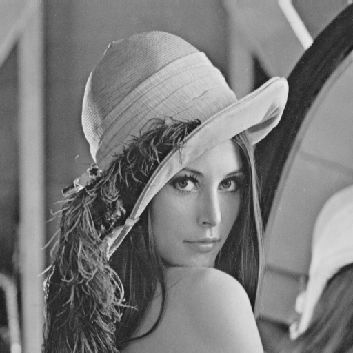
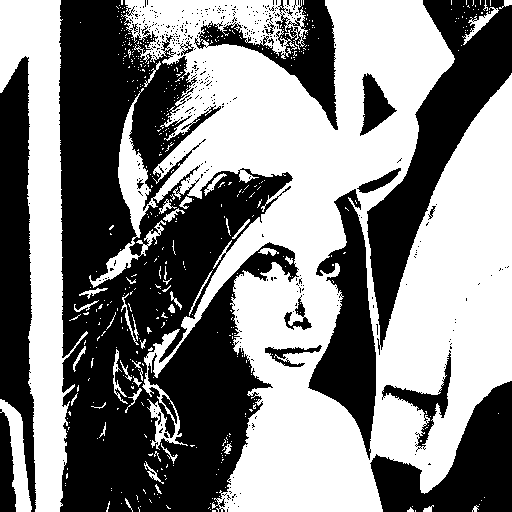

# Dimensionality Reduction

This repository contains my solution for a challenge from the DIO Machine Learning Specialist course. The objective was to convert a color image to grayscale (black and white). The script uses Python, along with the PIL (Pillow) and OS libraries, to process the iconic 'Lena' image.

# Images

